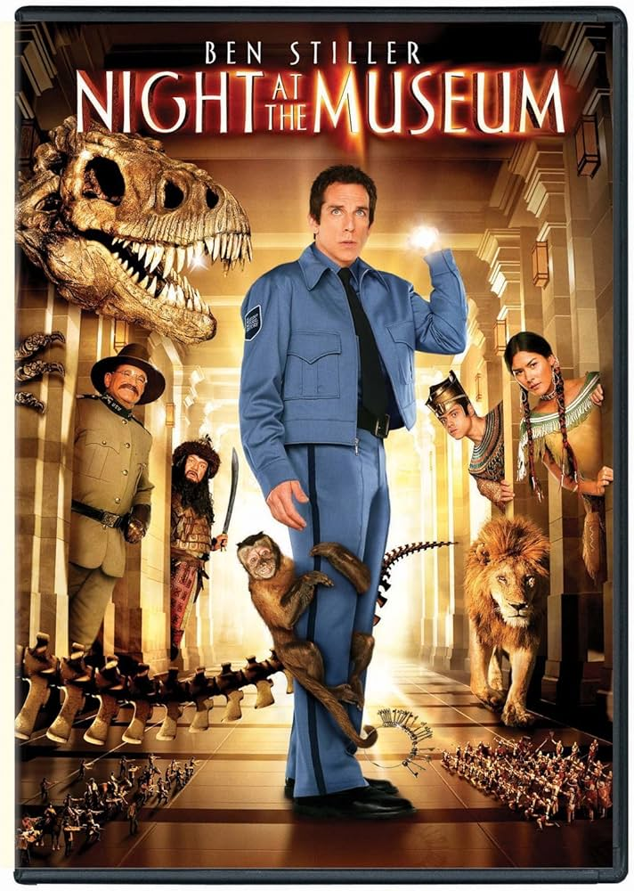

# Idea9103_Tut-1-Group-H_Major-Project_yuye0647

**Bold Text** or __Bold Text__
*Italic Text* or _Italic Text_

### How to interact with the work
This work supports mouse movement, mouse clicks, and a set of keyboard controls to bring the artwork to life.
- Keyboard press "**P**", daylight Only:camera flash photography effect
- Keyboard press "**D**", switch to **Daylight Mode**
- Keyboard press "**N**", switch to **Nighttime Mode**
- Keyboard press "**M**", nighttime Only: Activate Vehicle Animation
- Keyboard press "**S**", nighttime Only: Jitter Deconstruction Effect
- Nighttime only: Click the mouse to activate the building block's flashing effect.
- Nighttime Only: Mouse-follow moonlight halo lighting effect
Upon entering this painting, you'll be in daylight mode. Press the P key to activate the flash photography effect. Pressing N will gradually transition to night mode, where a moonlight halo appears around your mouse cursor to illuminate the scene. Clicking the mouse causes building blocks to flash. Pressing ‘m’ simulates bustling traffic, while pressing ‘s’ represents the scene collapsing and deconstructing. Users can stop interactive effects at any time using the corresponding interaction methods. Pressing ‘d’ to return to daylight mode halts all interactions, while returning to night mode resumes them.

### Individual approach to animating the group code
- **User Input**:Incorporate mouse or keyboard inputs for animation.
One reason my animation differs from my group members' is that our chosen interactive effects led to variations in theme and execution. My concept focused on making this exhibition piece alive. My animation modifications altered the artwork's spatial arrangement, lighting, and structural behavior—rather than its color, shape, or visibility layers. This created a god's-eye perspective, revealing how the artwork transforms between daytime and nighttime when no visitors are present. I developed an interactive effect that responds to mouse movement—something my team members couldn't achieve—and fully utilized keyboard and mouse clicks to dynamically alter the artwork's form and lighting.
##### Team member's pitch
**Member A**
Animation Drive Method: **Audio**
- Utilizes authentic urban ambient sounds or subway operation sounds as input
- Volume level controls subway movement speed, while rhythm dictates train acceleration, deceleration, or speed changes.
**Member B**
Animation Drive Method: **Time Based**
- Simulating the Alternation of Day and Night:
- Streetlights, traffic flow, and building brightness automatically adjust over time, creating the rhythmic cycle of urban life.
**Member C**
Animation Drive Method: **Perlin noise and randomness**
- Mouse controls the rotation angle of the entire 3D pattern
- Slider 1: Controls the speed and frequency of color changes
- Slider 2: Controls the amplitude of wave motion or the “breathing sensation”
- Marquee-like effect keeps the pattern flowing continuously through space
My personal idea is that this painting is exposed to flashlight during the day, yet quietly comes to life at night. Therefore, I added a gradient transition between Daylight Mode and Night Mode, along with interactive effects that appear on the painting at night. When re-exposed to daylight, everything ceases.
### References to inspiration for animating your individual code
This idea didn't stem from any specific source of inspiration. Instead, it was sparked by the themes of novels and films I'd previously encountered, which I then integrated with the subject matter of our work to develop my project in this direction.

I've always been fascinated by the concept of an object's vitality, so once our team finished coding, my immediate thought was to infuse this artwork with life as its central theme—artworks breathe too.
### Technical explanation of how individual code works to animate the image and any appropriate references